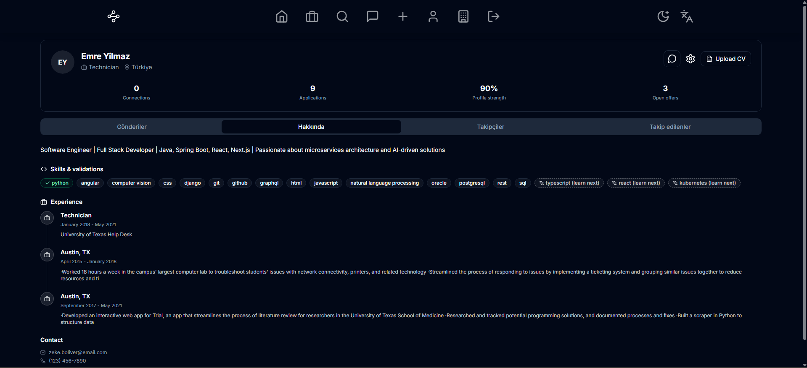
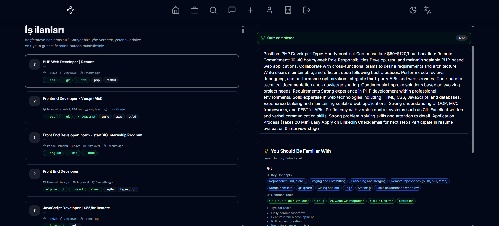
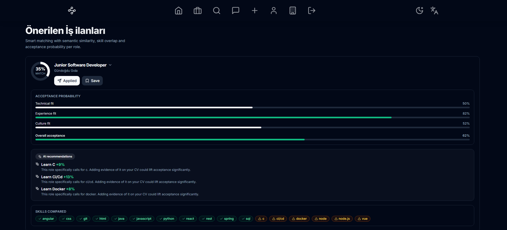
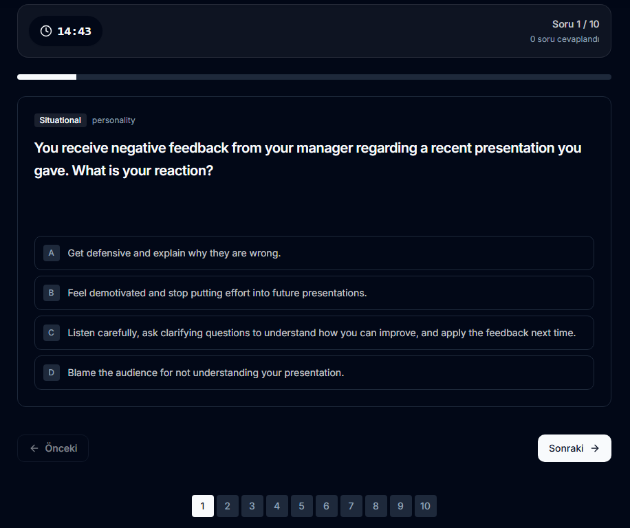
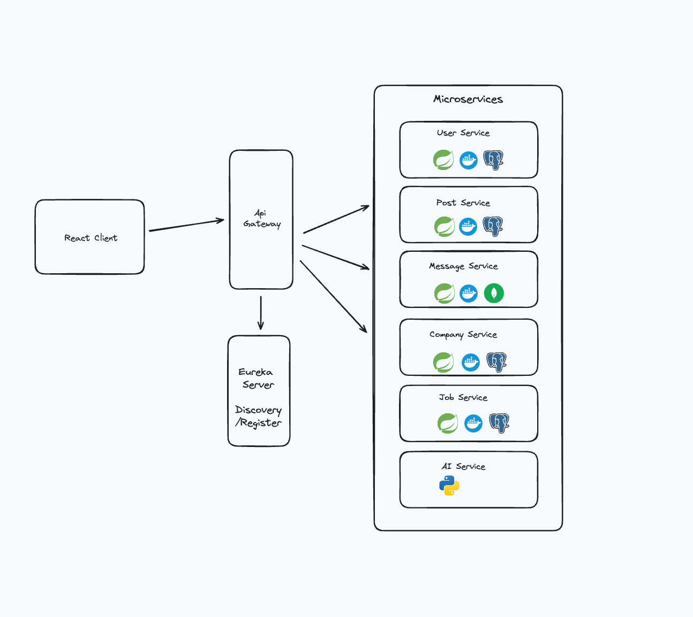

# KariyerLink — AI-Powered Career Networking Platform

A LinkedIn-inspired professional networking platform enhanced with AI-driven job matching, CV parsing, skill assessment quizzes, and intelligent job scraping.

---

## Screenshots

<p align="center">
  
  <br><em>User Profile — Skills and validations, experience, CV upload, and profile strength score</em>
</p>

<p align="center">
  
  <br><em>Job Listings — Browse jobs with skill tags, quiz completion status, and "You Should Be Familiar With" panel</em>
</p>

<p align="center">
  
  <br><em>AI-Recommended Jobs — Match percentage, acceptance probability breakdown, AI skill gap recommendations, and skills compared</em>
</p>

<p align="center">
  
  <br><em>Skill Assessment Quiz — Timed personality and technical quizzes with multiple-choice questions</em>
</p>

---

## Key Features

- **AI Job Matching** — TF-IDF and skill-based hybrid recommendation engine that matches users to jobs based on their profile and CV
- **CV Parsing** — Upload PDF resumes to automatically extract skills, education, and experience sections
- **Skill Assessment Quizzes** — Auto-generated quizzes based on job requirements, with a curated question bank
- **LinkedIn Job Scraper** — Automated Puppeteer-based scraper that collects real job listings and pushes them to the database
- **Real-time Messaging** — WebSocket-powered messaging between users, backed by MongoDB
- **Career Gap Analysis** — Compares user skills against job requirements and identifies skill gaps with actionable recommendations
- **Company Profiles** — Company management with job postings
- **Responsive UI** — Modern Next.js 14 frontend with TailwindCSS and shadcn/ui

---

## Architecture

This project follows a microservices architecture orchestrated with Docker.

<p align="center">
  
</p>

| Service | Technology | Port | Database |
|---|---|---|---|
| API Gateway | Spring Cloud Gateway | 8000 | — |
| User Service | Spring Boot | 8020 | PostgreSQL |
| Job Service | Spring Boot | 8040 | PostgreSQL |
| Post Service | Spring Boot | 8010 | PostgreSQL |
| Company Service | Spring Boot | 8181 | PostgreSQL |
| Message Service | Spring Boot, WebSocket | 8100 | MongoDB |
| AI Service | FastAPI, Scikit-learn | 3030 | — |
| Config Server | Spring Cloud Config | 8888 | — |
| Discovery Server | Eureka | 8761 | — |
| Frontend | Next.js 14, TailwindCSS | 3000 | — |
| Job Scraper | TypeScript, Puppeteer | CLI | — |

---

## Getting Started

### Prerequisites

- [Docker](https://www.docker.com/) and Docker Compose
- [Node.js](https://nodejs.org/) v18 or later
- [Java JDK 17+](https://adoptium.net/)

### 1. Clone the Repository

```bash
git clone https://github.com/adlhyvc/KariyerLink.git
cd KariyerLink
```

### 2. Start Backend Services

```bash
cd networking-platform-microservice-master
docker-compose up --build
```

This starts all microservices, databases, and the AI service.

### 3. Start the Frontend

```bash
cd networking-app-next-main
npm install
npm run dev
```

The frontend will be available at `http://localhost:3000`.

### 4. LinkedIn Job Scraper (Optional)

```bash
cd linkedin-job-scraper
cp .env.example .env
# Edit .env with your LinkedIn session cookie
npm install
npm run scrape
```

### Environment Variables

Each component includes a `.env.example` file. Copy and configure them before running:

```bash
cp networking-app-next-main/.env.example networking-app-next-main/.env
cp linkedin-job-scraper/.env.example linkedin-job-scraper/.env
```

---

## AI Service API

| Endpoint | Method | Description |
|---|---|---|
| `/recommendation/` | POST | Get job recommendations based on user profile |
| `/cv/parse/` | POST | Upload and parse a PDF CV |
| `/cv/recommend/` | POST | Get recommendations based on CV upload |
| `/quiz/generate/` | POST | Generate a skill assessment quiz |
| `/quiz/generate-for-job/` | POST | Generate a quiz based on a specific job listing |
| `/quiz/validate/` | POST | Validate quiz answers and return score |
| `/jobs/parse-skills/` | POST | Extract tech skills from text |
| `/jobs/parse-skills-batch/` | POST | Batch-extract skills for all jobs in the database |

---

## Tech Stack

**Backend:** Java 17, Spring Boot, Spring Cloud (Gateway, Config, Eureka), PostgreSQL, MongoDB, Docker

**AI Service:** Python, FastAPI, Scikit-learn, TF-IDF, NumPy, Pydantic

**Frontend:** Next.js 14, React, TypeScript, TailwindCSS, shadcn/ui, i18next

**Scraper:** TypeScript, Puppeteer, Node.js

---

## Acknowledgments

This project is built upon the open-source foundation created by [@akifzdemir](https://github.com/akifzdemir):

- [networking-platform-microservice](https://github.com/akifzdemir/networking-platform-microservice) — Backend microservices architecture
- [networking-app-next](https://github.com/akifzdemir/networking-app-next) — Frontend Next.js application

### What Was Added

The following features were developed on top of the original project:

- **AI Service** — Complete recommendation engine with TF-IDF and skill matching
- **CV Parser** — PDF CV parsing and structured data extraction
- **Quiz System** — Auto-generated skill assessment quizzes with question bank
- **LinkedIn Job Scraper** — Automated scraper with database integration
- **Career Gap Analysis** — Skill gap detection and learning path recommendations
- **Job Skill Extraction** — NLP-based skill parsing from job descriptions
- **Backend Modifications** — Additional endpoints for scraped job ingestion, CV storage, and skill management

---

## License

This project is for educational and portfolio purposes. See [Acknowledgments](#acknowledgments) for attribution of original works.
